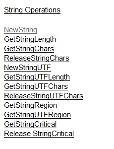
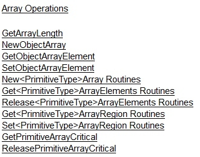
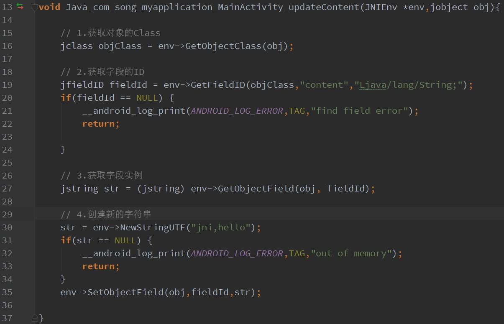
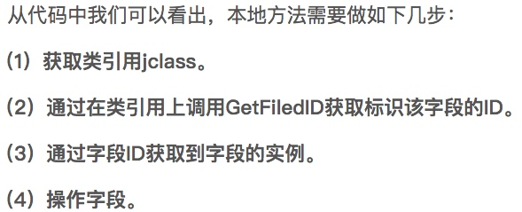
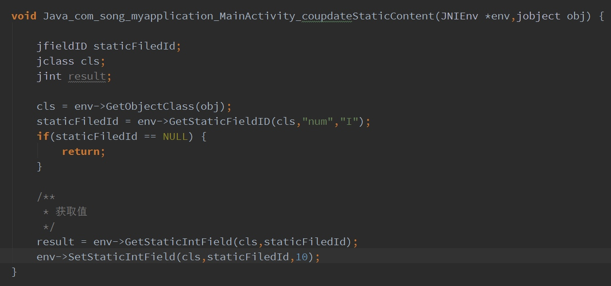
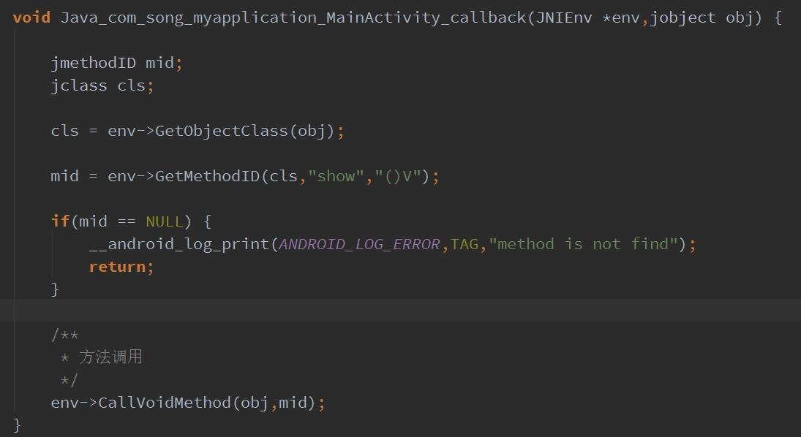
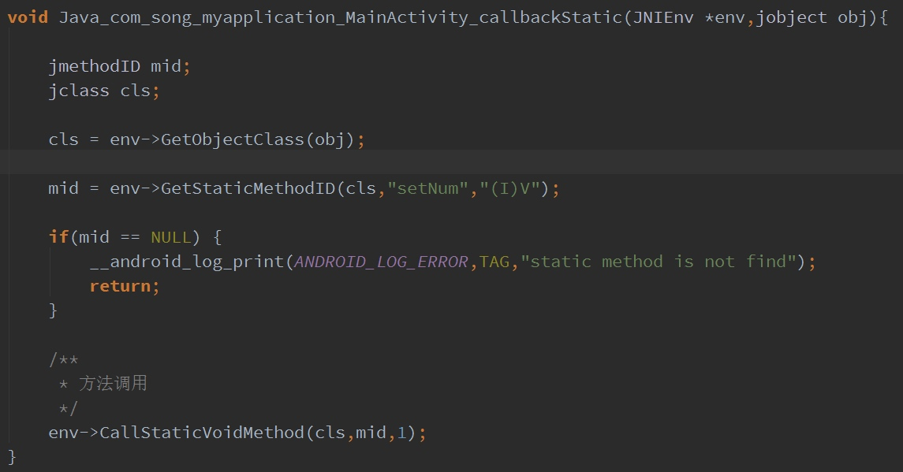
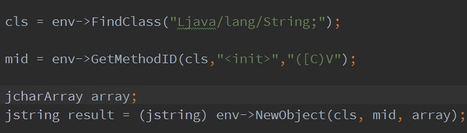

# Android_JNI
* [向您的项目添加 C 和 C++ 代码](https://developer.android.com/studio/projects/add-native-code.html)
* [JNI Tips](https://developer.android.com/training/articles/perf-jni.html)

```
Java Native Interface
```
Java Native Interface Specification—Contents
https://docs.oracle.com/javase/7/docs/technotes/guides/jni/spec/jniTOC.html

Introduction
https://docs.oracle.com/javase/7/docs/technotes/guides/jni/spec/intro.html

Design Overview
https://docs.oracle.com/javase/7/docs/technotes/guides/jni/spec/design.html

JNI Types and Data Structures
https://docs.oracle.com/javase/7/docs/technotes/guides/jni/spec/types.html


JNI Functions
https://docs.oracle.com/javase/7/docs/technotes/guides/jni/spec/functions.html


[JNI完全指南(一)——数据类型](https://www.zybuluo.com/cxm-2016/note/563686)

类型签名 | 对应的Java类型
---|---
Z | boolean
B | byte
C | char
S | short
I | int
J | long
F | float
D | double
L全类名; | 类
[ type | type[]
(参数类型签名,...)返回值类型签名 | 方法类型

[JNI完全指南(四)——对象操作](https://www.zybuluo.com/cxm-2016/note/566595)


JNI 字符串
http://blog.csdn.net/u013718120/article/details/64495238
https://www.zybuluo.com/cxm-2016/note/566597
构造新字符、获取 / 释放Jvm层字符串、获取字符串长度



JNI 数组
http://blog.csdn.net/u013718120/article/details/64906896



JNI字段和方法
http://blog.csdn.net/u013718120/article/details/64919645
一、字段访问

  Java中支持两种字段：

  1. 对象字段



  2. 多个对象所共享一个类的静态字段


二、方法回调
  Java中有两种方法的定义：

  1. 实例方法

  2. 静态方法

```
调用实例方法和静态方法也很相似，流程依然是先获取方法ID，并且获取实例方法ID和静态方法ID的返回值类型都是jmethodID。最后调用CallXXXMethod或CallStaticXXXMethod来执行方法的回调，如果有参数，直接在方法的最后按参数定义顺序传入即可。唯一区别在于调用静态方法的函数添加了static关键字。
获取实例方法ID的函数是GetMethodID(jobject，methodName，methodDesc)
methodDesc：方法描述符
JNI规定，方法描述符的定义为：
（参数类型描述符）返回值类型描述符
例如：public void getName()方法的描述符为：（）V；public String getString(String name)方法的描述符为：（Ljava/lang/String;）Ljava/lang/String;
public void setArray（int[] arrays）方法的描述符为：（[I）V
```

  3. 调用父类方法

  JNI提供了访问父类的实例方法函数。流程如下：

   1. 使用GetMethodID从一个指向父类的引用当中获取方法ID。

   2. 传入对象，父类，方法ID和参数，调用CallNonvirtualXXXMethod方法即可。

  一般情况下，在java中调用父类很方便，super.x()即可。所以该方式使用较少。
  
  4. 调用构造函数
调用构造函数和调用实例方法基本类似。有几点不同：

   1. 方法名传入：<init>

   2. 方法描述符中，返回值类型为 V

上述代码中，首先通过FindClass获取String类，然后获取String（char[]）方法的ID，最终通过NewObject方法创建了该实例。

  即：
   char[] array = new char[10];
   String result = new String(array);


