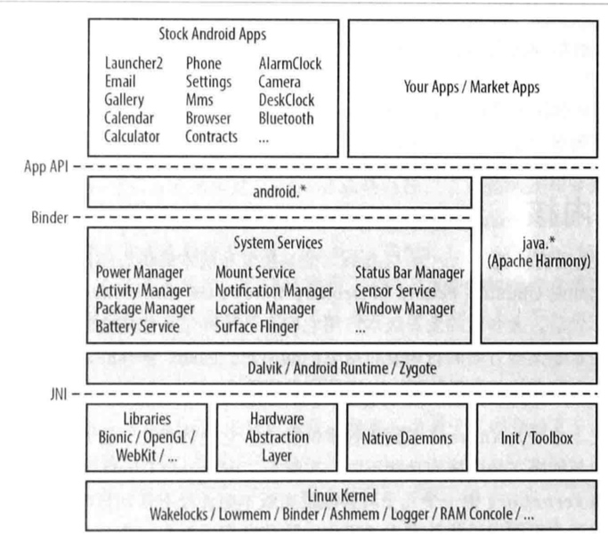
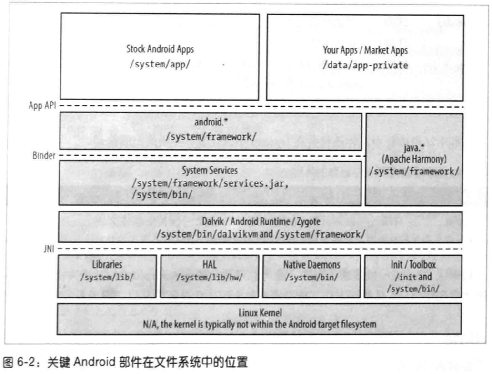
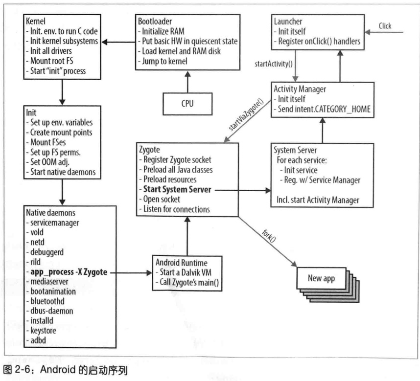
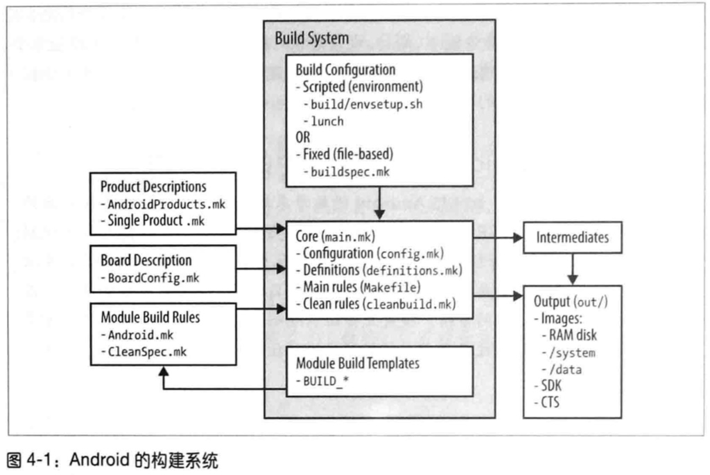
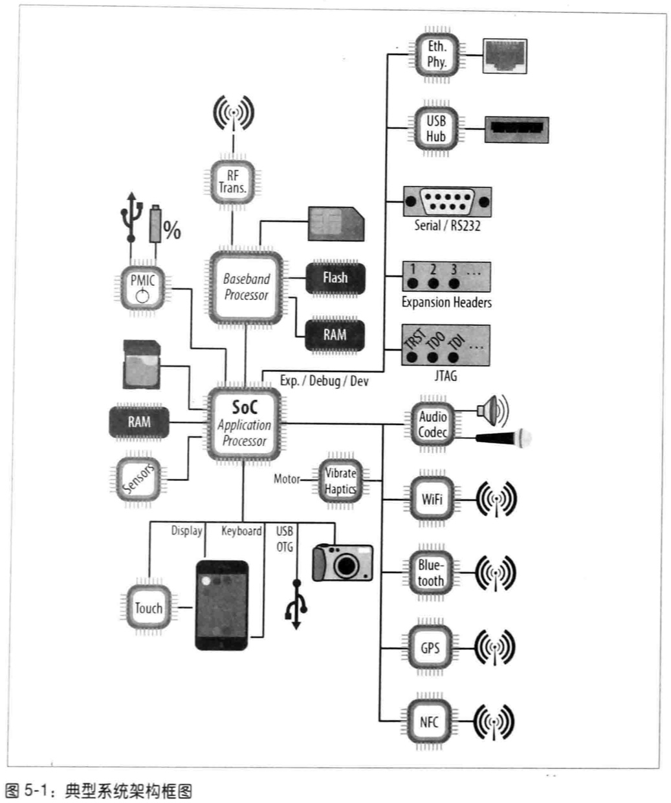
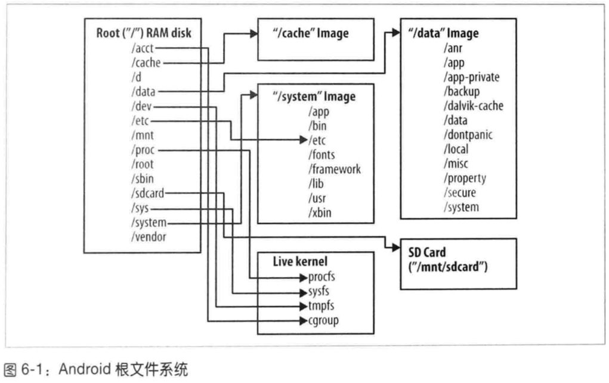
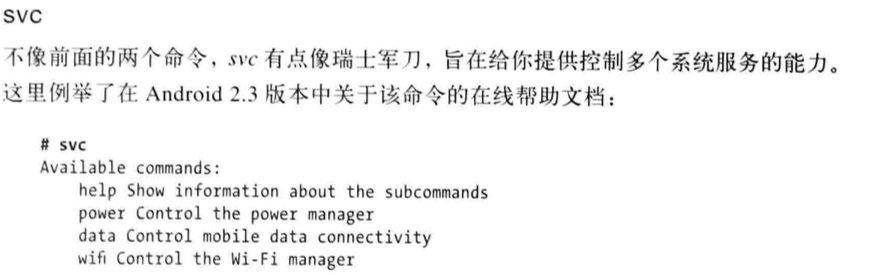
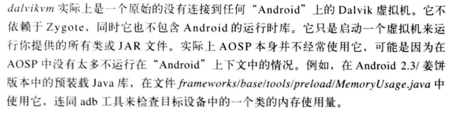
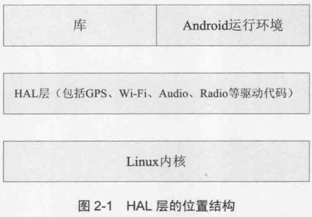

# 构建嵌入式Android系统

2018年10月10日

硬件与合规性要求
ACP, Application Compatibility Program
    CDD, Compliance Definition Document 兼容性定义文档
    CTS, Compliance Test Suit 兼容性测试套件

https://source.android.com/compatibility

Android 的结构






[Google I/O 2008 - Dalvik Virtual Machine Internals](https://www.youtube.com/watch?v=ptjedOZEXPM)

HAL (Hardware Abstraction Layer)


开源代码查看

Ctags
[AndroidXRef](http://androidxref.com/)



## 第三章 AOSP入门

AOSP 标签和分支查看技巧

```shell
mkdir -p ~/android/aosp-branches-tags
cd ~/android/aosp-branches-tags
git clone https://android.googlesource.com/platform/manifest.git
cd manifest
git tag
git branch -a
```

有多少构建模块？
```shell
find . -name Android.mk | wc -l
```





BP (Baseband Processor) 系带处理器
AP (Application Processor) 应用处理器
RTOS (Real-time OS) 实时操作系统
eMMC (embedded MultiMediaCard) 嵌入式多媒体卡
PMIC (Power Management IC) 电源管理芯片




FHS (Filesystem Hierarchy Standard) 文件系统目录标准

ddms (Dalvik Debug Monitor Server) Davik调试监控服务器

```shell
su
// 关闭zygote
stop zygote

// 手动启动zygote
start zygote
```






# 最强Android书 架构大剖析-崔孝晨-译

# ANDROID源码分析实录




