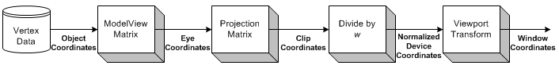
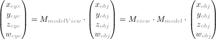
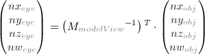
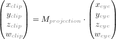
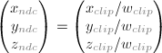
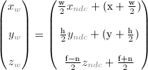
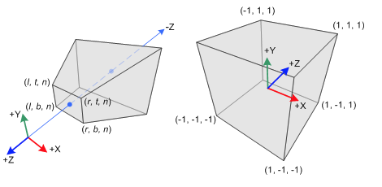
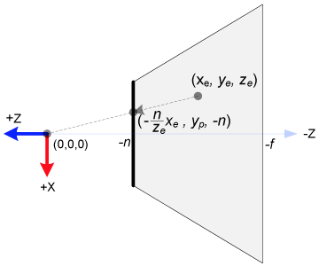
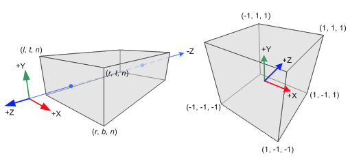

# OpenGLES2.0原理浅析

* [OpenGLES2.0原理浅析](http://blog.sina.com.cn/s/blog_a23d30f101018gl4.html)

## OpenGLES2.0原理浅析

OpenGLES通过获取物体的控件**顶点信息**, 可以实现3维物体到2维物体的坐标转换输出到屏幕，并且可以对物体实现平移，旋转，缩放，而且利用着色器可编程渲染通道实现多种光学作用， 特殊形状变换等效果。从而能实现丰富的物体再现功能。

### 几种OpenGL变换
 通过模拟人眼观察物体, 可能引起屏幕图像改变的几种行为和分别对应的几种OpenGL变换:
每种变换都可以由相应的Matrix静态方法生成相应的变换矩阵。 坐标系原点在屏幕中央,z轴正方向垂直屏幕向外。

| 变换 | 行为 | 记录变换方式的方法 | 记录变换方式的[4*4]矩阵  |
| --- | --- | --- | --- |
| 试图变换 | 眼睛像对物体的位置改变 |  <div>Matrix.setLookAtM（mVMatrix,</div><div>0,//偏移量</div><div>cx, cy, cz,//相机位置,</div><div>tx, ty, tz,//观察点位置</div><div>upx, upy, upz//顶部朝向</div><div>）</div> | mVMatrix[16]  |
|  |  |  |  |
| 模型变换 | 物体平移 |  <div>Matrix.translateM(</div><div>mMMatrix,</div><div>0,//偏移量</div><div>x, y, z//平移量</div><div>)</div> | mVMatrix[16] |
| 模型变换 | 物体按坐标缩放比例缩放 |  <div>Matrix.scaleM(</div><div>mMMatrix,</div><div>sx,sy, sz//缩放因子</div><div>)</div> | mVMatrix[16] |
| 模型变换 | 物体旋转 |  <div>Matrix.rotateM(</div><div>mMMatrix,</div><div>0,//偏移量</div><div>angle,//旋转角度</div><div>x, y, z//需要旋转的轴</div><div>)</div> | mVMatrix[16] |
|  |  |  |  |
| 投影变换 | 凸透镜眼睛 |  <div>Matrix.frustumM(</div><div>mPMatrix,</div><div>0,//偏移量</div><div>left,right,</div><div>buttom,top,</div><div>near,far//near>0</div><div>)</div> | mPMatrix[16] |
| 投影变换 | 平面透镜眼睛 |  <div>Matrix.orthoM(</div><div>mPMatrix,</div><div>0,//偏移量</div><div>left,right,</div><div>buttom,top,</div><div>near,far//near>0</div><div>)</div> | mPMatrix[16] |

PS: 如果眼睛不是凸透镜而是平面透镜, 则不会产生近小远大的效果, 视图变换可由人眼模拟。函数参数都是float。


* [OpenGL Transformation](http://www.songho.ca/opengl/gl_transform.html)
    * [matrixModelView_mac.zip (OS X 10.6+)](http://www.songho.ca/opengl/files/matrixModelView_mac.zip)
    * [matrixProjection_mac.zip (OS X 10.6+)](http://www.songho.ca/opengl/files/matrixProjection_mac.zip)






Normalized Device Coordinates (NDC)


Window Coordinates (Screen Coordinates)



* [OpenGL Projection Matrix](http://www.songho.ca/opengl/gl_projectionmatrix.html)
* Perspective Projection


Perspective Frustum and Normalized Device Coordinates (NDC)


In perspective projection, a 3D point in a truncated pyramid frustum (eye coordinates) is mapped to a cube (NDC); the range of x-coordinate from [l, r] to [-1, 1], the y-coordinate from [b, t] to [-1, 1] and the z-coordinate from [n, f] to [-1, 1].

Note that the eye coordinates are defined in the right-handed coordinate system, but NDC uses the left-handed coordinate system. That is, the camera at the origin is looking along -Z axis in eye space, but it is looking along +Z axis in NDC. Since glFrustum() accepts only positive values of near and far distances, we need to negate them during the construction of GL_PROJECTION matrix.


* Orthographic Projection


Orthographic Volume and Normalized Device Coordinates (NDC)

Constructing GL_PROJECTION matrix for orthographic projection is much simpler than perspective mode.

All xe, ye and ze components in eye space are linearly mapped to NDC. We just need to scale a rectangular volume to a cube, then move it to the origin. Let's find out the elements of GL_PROJECTION using linear relationship.


变换叠加: 可通过变换矩阵相乘得出想要的变换矩阵： 
`Matrix.multiplyMM(float[] result ///存放结果的总变换矩阵, 
            int resultOffset ///结果矩阵偏移量,
            float[] lhs, 
            int lhsOffset //左矩阵偏移量, 
            float[] rhs, int rhsOffset //右矩阵偏移量);`

变换技巧： 利用栈存储变换矩阵的算法可实现复杂场景的图形变换和提高渲染效率。
变换顺序： 矩阵相乘是讲究顺序的， 比如先平移再缩放 和 先缩放再平移的效果是不同的。


### 绘制方式

| 点 | GLES20.GL_POINTS |
| --- | --- |
| 线  |  <div>GLES20.GL_LINES</div><div>GLES20.GL_LINE_STRIP</div><div>GLES20.GL_LINE_LOOP</div> |
| 面  |  <div>GLES20.TRIANGLES</div><div>GLES20.TRIANGLE_TRIP//条带,可间断</div><div>GLES20.TRIANGLE_FAN//扇面</div> |

非索引法: GLES20.glDrawArrays(GLES20.GL_POINTS, 0, vCount);
索引法 ：GLES20.glDrawElements(GLES20.GL_POINTS, iCount, GLES20.GL_UNSIGNED_BYTE,  mIndexBuffer);


## android的openGLES2.0程序设计框架浅析
主要实现流程有如下顺序的几点操作:
定义物体顶点信息 –> 编辑着色器代码 –> 编译连接着色器程序 -> 物体顶点信息传入着色器 –> GLSurfaceView加载Renderer –> Activity加载GLSurfaceView -> 渲染物体输出屏幕

### 定义物体顶点信息
顶点信息一般包括：
(1)三维坐标信息; (2)三维法向量信息;(3)颜色信息或二维贴图坐标信息;
复杂物体的坐标通常通过特定的软件绘制生成顶点信息文件,然后进行解读;

### 编辑着色器代码
 着色器语言编写的代码, 通常后缀名.sh, 语法和C相似95%以上, 是OpenGLES2.0的可编程渲染通道, 增加了编程难度, 但是能实现更绚丽多彩的效果。
一般编写好的着色器代码放在android工程目录下的assets文件, assets常用轻量资源的读写。

### 编译连接着色器程序
从assets获取着色器脚本, 并返回脚本字符串的过程：

* 主要方法：
`(1. InputStream in = rgetAssets.open(fname);
(2. in 转化为 ByteArrayOutputStream out
(3. byte[] bout = out.toByteArray(); 记得close in&out
(4. String result = (new String(bout, “UTF-8”)).replaceAll(\\r\\n, “\n”);`

* 加载片元着色器和顶点着色器的方法：
(1.       申请特定着色器
`int shaderId = GLES20.glCreateShader(shaderType);// shaderType  GLES20.GL_VERTEX_SHADER(顶点)   GLES20.GL_FRAGMENT_SHADER(片元)`
如果申请成功则返回的shaderId不为零
(2.   给申请成功的着色器加载脚本并编译,查错

    ```
GLES20.glShaderSource(shaderId, source);/// source是脚本字符串
GLES20.glCompileShader(shaderId);///编译
int compiles[1];
GLES20.glGetShaderiv(shaderId, GLES20._GL_COMPILE_STATUS, compiles, 0);///查看编译情况
if(compiles[0] == 0){//编译失败,释放申请的着色器
   GLES20.glDeleteShader(shaderId);
   shaderId = 0;
}
```
* 编译连接并生成着色器程序：
(1.申请着色器程序：`int program = GLES20.glCreateProgram();`
(2.加入两种着色器并查错(方法一样)：

```
GLES20.glAttachShader(programe, vertexShaderId);
int error;
while((error = GLES20.glGetError()) != GLES20.GL_NO_ERROR){
   throw (new RuntimeException(ShaderName + “attach Error”))
}
```
(3.连接着色器程序,并查看连接情况


```java
GLES20.glLinkProgram(program);
int LinkStatus[ 1];
GLES20.glGetPromgramiv(program, GLES20.GL_LINK_STATUS, LinkStatus, 0);
if (LinkStatus[0] != GLES20.GL_TRUE) {
  Log.e(“Link Error”, GLES20.glGetProgramInfoLog(program));
  GLES20.glDeletePromgram(program);
  program = 0;
}
```
至此可以利用program进行该着色器的利用。

### 物体顶点信息传入着色器

生成顶点信息, 用FloatBuffer类存储的一般方法：
```
float vertexs[] = {1, 2, 3}
ByteBuffer bbv = ByteBuffer.allocateDirect(vertexs.length * 4);//一个float 4个字节
bbv.order(ByteOrder.nativeOrder());///前期设置
vertexBuffer = bbv.asFloatBuffer();//作为中介开辟FloatBuffer
vertexBuffer.put(vertexs);      //存入信息
vertexBuffer.position(0);       //设置起始位置为0;
```
获取着色器参数ID
`int maPositionHandler = GLES20.glGetAttribLocation(program, “aPosition”);`
传入数据

```java
GLES20.glVertexAttribPointer(
        maPositionHandle,  
        3,
        GLES20.GL_FLOAT,
        false,
        3*4,  
        mVertexBuffer
);
```
使用数据：`GLES20.glEnableVertexAttribArray(maPositionHandle); `

### GLSurfaceView加载Renderer
初始化GLSurfaceView

```java
setEGLContextClientVersion(2);//设置版本
setRanderer(new MyRenderer());//增添渲染器
setRenderMode(GLSurfaceView.RENDERMODE_CONTINUOUSLY);//主动渲染模式
```
自定义渲染器,实现3个渲染接口,例如：


```java
    private class MyRenderer implements GLSurfaceView.Renderer {
        Triangle tle;
        public void onDrawFrame(GL10 gl) {
            //清除深度缓冲与颜色缓冲
            GLES20.glClear(GLES20.GL_DEPTH_BUFFER_BIT | GLES20.GL_COLOR_BUFFER_BIT);
            //绘制三角形对
            tle.drawSelf();
        }

        public void onSurfaceChanged(GL10 gl, int width, int height) {
            //设置视窗大小及位置
            GLES20.glViewport(0, 0, width, height);
            //计算GLSurfaceView的宽高比
            float ratio = (float) width / height;
            //调用此方法计算产生透视投影矩阵
            Matrix.frustumM(Triangle.mProjMatrix, 0, -ratio, ratio, -1, 1, 1, 100);
            //调用此方法产生摄像机9参数位置矩阵
            Matrix.setLookAtM(Triangle.mVMatrix, 0, 0, 0, 3, 0f, 0f, 0f, 0f, 1.0f, 0.0f);
        }

        public void onSurfaceCreated(GL10 gl, EGLConfig config) {
            //设置屏幕背景色RGBA
            GLES20.glClearColor(0, 0, 0, 1.0f);
            //创建三角形对对象
            tle = new Triangle(MyTDView.this);
            //打开深度检测
            GLES20.glEnable(GLES20.GL_DEPTH_TEST);
            rthread = new RotateThread();
            rthread.start();
        }
    }
```

### Activity加载GLSurfaceView

### 渲染物体输出屏幕


