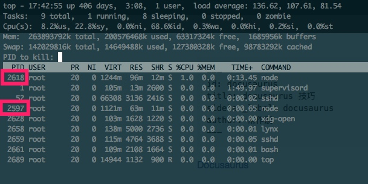

# Docurus 文档本地预览
1. 安装brew
```/usr/bin/ruby -e "$(curl -fsSL https://raw.githubusercontent.com/Homebrew/install/master/install)"```

2. 安装node
http://nodejs.cn/download/

安装 docusaurus
```
npm install -g docusaurus
npm install --global docusaurus-init
```
3. 安装yarn
```
brew install wget
brew install yarn
brew upgrade yarn
```
4. 进入folder_path/website

```bash
yarn install
yarn upgrade docusaurus --latest
```
	
5. yarn start
6. http://localhost:3000/

# Docurus 添加文档
* 在docs目录中添加markdown文件，编辑文件
* 在文件头部添加

```
---
id: readme
title: readme
sidebar_label: 侧边栏显示标题
author: 作者
---
```
* 修改 folder_path/website/sidebars.json  
	* 在合适的位置添加对应的id，id就是markdown 头部写的id
* 保存之后，ctrl+c终止服务，重新运行yarn start

* PS：如果只是修改文档内容，没有调整文档，则不需要重启服务，只要保存修改后，刷新浏览器页面就能看到改动了


# Docurus 推送发布
本地预览没有问题之后推送到git服务器

* ssh root@ip_address

* cd folder_path
* git pull

* cd website
* ./kill.sh
* top
* k

输入进程号，回车，输入15

* ./restart.sh
* ctrl + c
* top


# ref


[Docusaurus](https://github.com/facebook/Docusaurus)

