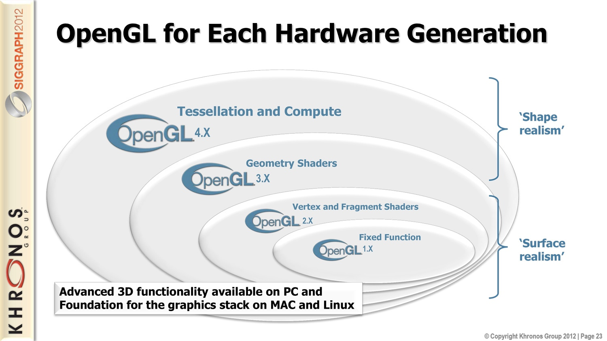
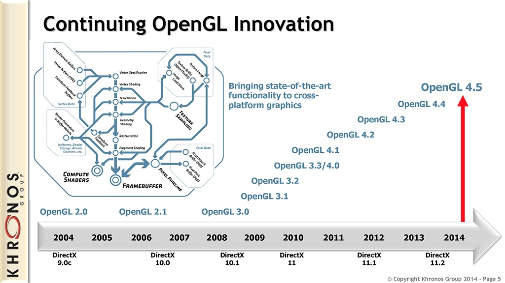
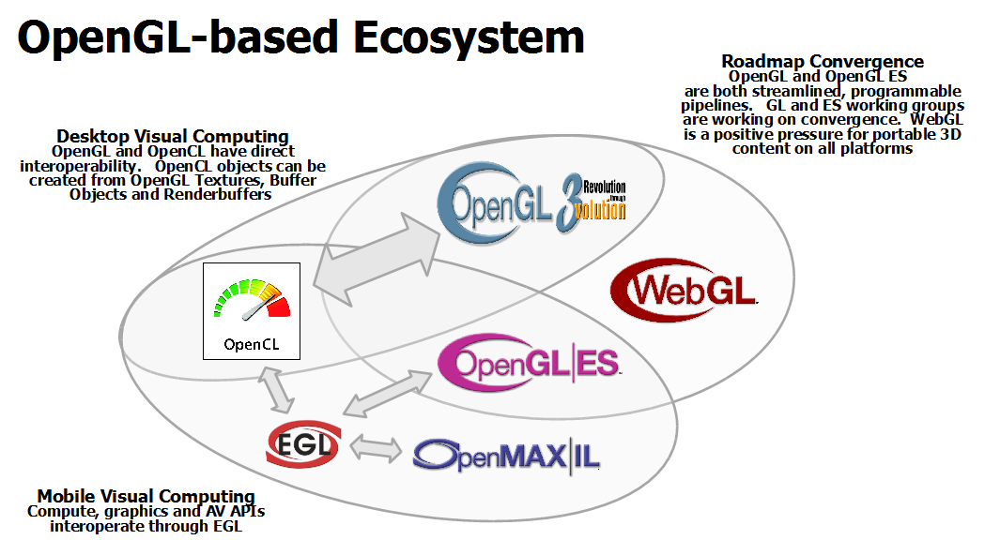
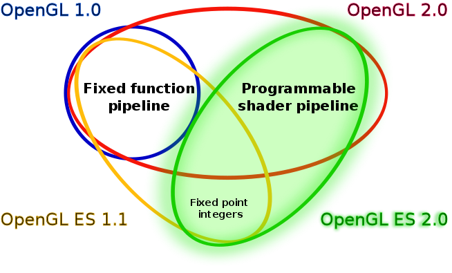
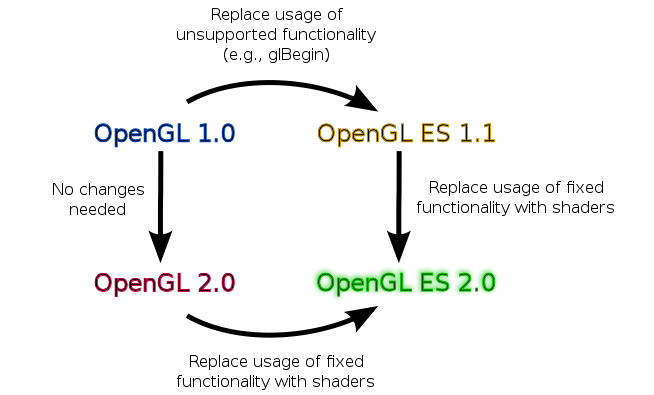
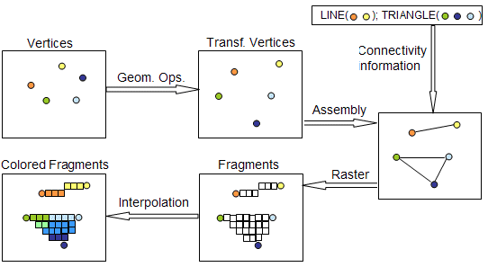
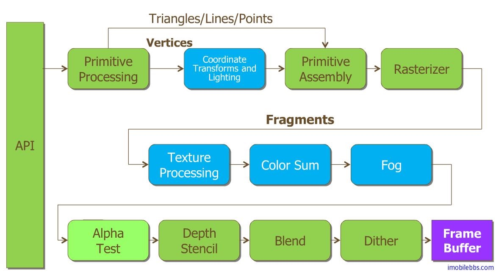

# versions
https://www.khronos.org/opengl/wiki/History_of_OpenGL

[OpenGL-ES](https://wiki.maemo.org/OpenGL-ES)

[OpenGL ES 管道(Pipeline)](http://wiki.jikexueyuan.com/project/opengl-es-guide/pipeline.html)

 OpenGL ES 1.x 固定管道的结构图

管道“工序”大致可以分为 Transformation Stage 和 Rasterization Stage 两大步。
OpenGL ES 支持的基本图形为 点 Point, 线 Line, 和三角形 Triangle ，其它所有复制图形都是通过这几种基本几何图形组合而成。
在发出绘图指令后，会对顶点(Vertices)数组进行指定的坐标变换或光照处理。
顶点处理完成后，通过 Rasterizer 来生成像素信息，称为”Fragments“ 。
对于 Fragment 在经过 Texture Processing, Color Sum ,Fog 等处理并将最终处理结果存放在内存中（称为FrameBuffer)。
OpenGL 2.0可以通过编程来修改蓝色的步骤，称为 Programmable Shade

