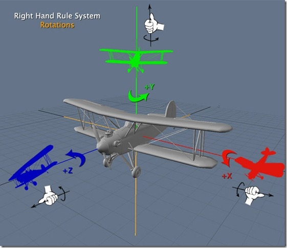

* [OpenGLES2.0原理浅析](OpenGLES2.0原理浅析.md)
* [OpenGL INFO](OpenGL INFO.md)
* [着色器语言 GLSL (opengl-shader-language)入门大全](https://github.com/wshxbqq/GLSL-Card)
* [[OpenGL ES 03]3D变换：模型，视图，投影与Viewport](http://blog.csdn.net/kesalin/article/details/7168967)



* [OpenGLES Android篇零基础系列(一)：OpenGLES2.x可渲染管道基本流程](http://www.imooc.com/article/16587)
```
OpenGL ES已经发展有了3个版本，OpenGL ES 1.0 , OpenGL ES 2.0 , OpenGL ES 3.0。其中OpenGL ES 1.0 是以OpenGL 1.3规范为基础，OpenGL ES 2.0 是以OpenGL 2.0 为基础，OpenGL ES 3.0是移动设备专用，以OpenGL 4.3为标准
```


* [OpenGLES 入门(一)着色器简介](http://www.jianshu.com/p/36277c51f47e)


```c
uniform mat4 uMVPMatrix;                 // 应用程序传入顶点着色器的总变换矩阵
attribute vec4 aPosition;                // 应用程序传入顶点着色器的顶点位置
attribute vec2 aTextureCoord;            // 应用程序传入顶点着色器的顶点纹理坐标
attribute vec4 aColor                    // 应用程序传入顶点着色器的顶点颜色变量
varying vec4 vColor                      // 用于传递给片元着色器的顶点颜色数据
varying vec2 vTextureCoord;              // 用于传递给片元着色器的顶点纹理数据
void main()
{
    gl_Position = uMVPMatrix * aPosition;// 根据总变换矩阵计算此次绘制此顶点位置
    vColor = aColor;                     // 将顶点颜色数据传入片元着色器
    vTextureCoord = aTextureCoord;       // 将接收的纹理坐标传递给片元着色器
}
```


```c
precision mediump float;   // 设置工作精度
varying vec4 vColor;       // 接收从顶点着色器过来的顶点颜色数据
varying vec2 vTextureCoord;// 接收从顶点着色器过来的纹理坐标
uniform sampler2D sTexture;// 纹理采样器，代表一幅纹理
void main()
{                                                                                   
    gl_FragColor = texture2D(sTexture, vTextureCoord) * vColor;// 进行纹理采样
}
```

* [OpenGLES入门(二)创建program](http://www.jianshu.com/p/cdc3a4c4db0b)
* [OpenGLES入门(三)与着色器交互](http://www.jianshu.com/p/64692105ca6f)


## 参考文献
* [OpenGL ES 2.0 API 快速查询卡片](https://www.khronos.org/opengles/sdk/docs/reference_cards/OpenGL-ES-2_0-Reference-card.pdf)
* [OpenGL® ES 2.0 Reference Pages](https://www.khronos.org/registry/OpenGL-Refpages/es2.0/)
* [OpenGL ES 着色器语言参考页 OpenGL® ES 3.1 Reference Pages](https://www.khronos.org/registry/OpenGL-Refpages/es3.1/index.php)
* [OpenGL ES 着色器语言](https://www.khronos.org/registry/OpenGL/specs/es/2.0/GLSL_ES_Specification_1.00.pdf)
* [OpenGLR ES Common Profile Specification Version 2.0.25](https://www.khronos.org/registry/OpenGL/specs/es/2.0/es_full_spec_2.0.pdf)
* [EGL registry](https://www.khronos.org/registry/EGL/)

* [Tutorials:OpenGL ES 2.0](http://tool.oschina.net/uploads/apidocs/android/resources/tutorials/opengl/opengl-es20.html)

