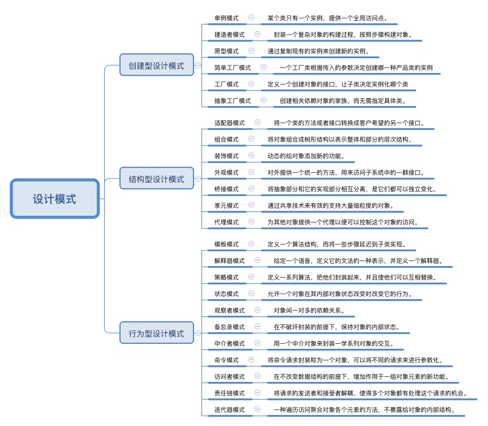

https://alibaba.github.io/rax/guide

https://github.com/ahmed-basyouni/AndroidKVO

https://github.com/JetBrains/kotlin

https://github.com/gradle/kotlin-dsl/tree/master/samples

https://www.androidos.net.cn/osarticle

	* [Android进程框架：线程与线程池](https://www.androidos.net.cn/article/fzmmxVegUU.html)

* [Android系统软件设计篇：设计模式](https://www.androidos.net.cn/article/fSQHzVegWk.html)

	

# research 

[wxapp](wxapp.md)

## Conductor
https://github.com/bluelinelabs/Conductor

主要特性:

易于集成
无需使用 Fragments 构建单 Activity 应用
简单但是功能强大的生命周期管理
导航和回退栈管理
view 之间动效切换
视图状态持久化
onActivityResult, onRequestPermissionsResult 等回调
不强制某种架构, 支持多种架构思想: MVP / MVVM / VIPER / MVC 等

