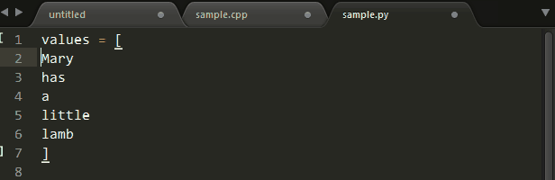
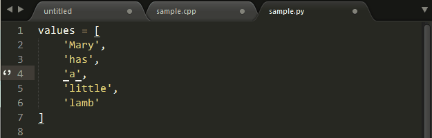

 默认Sublime使用Ctrl+`作为快捷键弹出Console

sublime.log_commands(True)

https://github.com/happypeter

有时我们需要对一片区域的所有行进行同时编辑，Ctrl+Shift+L可以将当前选中区域打散




有打散自然就有合并，Ctrl + J(mac下Command＋J)可以把当前选中区域合并为一行：



在Ctrl + P(Command+P)匹配到文件后，我们可以进行后续输入以跳转到更精确的位置：

```
@ 符号跳转：输入@symbol跳转到symbol符号所在的位置
# 关键字跳转：输入#keyword跳转到keyword所在的位置
: 行号跳转：输入:12跳转到文件的第12行。
```


Mac 常用符号如下：
⌘（command）
⌥（option）
⇧（shift）
⇪（caps lock）
⌃（control）
↩（return）
⌅（enter）

 

sublime  多行编辑 快速过滤日志
select some keyword
⌘ + ⌃ + G
⌘ + ←
⌘ + ⇧ + →
⌘ + C 
⌘ + N （创建新文件）
⌘ + V

