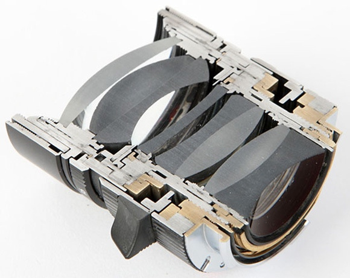

# 果冻效应

 只要是CMOS元件的摄像机都会有这个效果，PS：一句话：“只要针对拍摄快速移动物体产生的变形叫果冻效应”

[[UP!教程】航拍中的果冻效应](http://bbs.dji.com/thread-41018-1-1.html)

[为什么手机影片拍出来画面长这样？这则短片解释什么是 Rolling Shutter 果冻效应](http://technews.cn/2017/07/20/why-mobile-phone-film-footage-looks-like-is-actually-the-rolling-shutter-effect-a-ghost/)

https://bbs.dji.com/thread-63756-1-1.html

https://baike.baidu.com/pic/%E6%9E%9C%E5%86%BB%E6%95%88%E5%BA%94/4763603/780272/8694a4c27d1ed21b83485d46ad6eddc450da3f8b?fr=lemma&ct=cover#aid=780272&pic=8694a4c27d1ed21b83485d46ad6eddc450da3f8b

https://giphy.com/gifs/l4FGKE9WvBdHHBg3u?utm_source=iframe&utm_medium=embed&utm_campaign=Embeds&utm_term=https%3A%2F%2Fpetapixel.com%2F2017%2F06%2F30%2Frolling-shutter-effect-works%2F

# 相机构造

